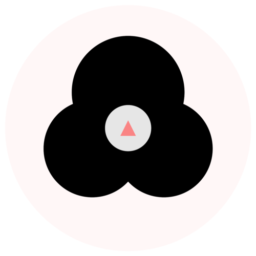

<h1 align="center">Welcome to Little Writing 👋</h1>
<p>
  
  
  <a href="#" target="_blank">
    
  </a>
</p>

<p align="center">
  
</p>

> A handwriting tracing app for kids built with React, react-konva, and Capacitor.

## Tech Stack

- **Frontend**: React 18+, TypeScript
- **Canvas**: react-konva
- **Mobile**: Capacitor (iOS)
- **Testing**: Vitest
- **State**: Zustand

## Getting Started

### Prerequisites

- Node.js LTS
- Bun (recommended) or npm

### Installation

```bash
bun install
```

### Development

```bash
bun run dev
```

Open http://localhost:5173 in your browser.

### Testing

```bash
bun test          # Run all tests
bun test --watch  # Watch mode
bun test --coverage  # With coverage
```

### Code Quality

```bash
just lint         # Oxlint
just typecheck   # TypeScript
just format      # Oxfmt (Prettier-compatible)
just quality     # Run all checks
```

### Building

```bash
bun run build
```

### Mobile (iOS)

```bash
npx cap sync       # Sync web assets to iOS
npx cap open ios   # Open in Xcode
```

## Project Structure

```
src/
├── components/     # React UI components
├── lib/            # Business logic (canvas, templates, feedback)
├── hooks/         # Custom React hooks
├── state/         # Zustand store
└── styles/        # Theme and animations
```

## Constitution Principles

1. **Child-Centric Design** - Touch targets ≥44px, bright colors, minimal UI
2. **Guided Stroke Learning** - Visual paths, real-time validation
3. **Touch-First Interaction** - 60fps performance, finger/stylus support
4. **Immediate Feedback** - Real-time validation, encouraging feedback
5. **Simplicity** - Focused on core tracing functionality

## Troubleshooting

### iOS: `Podfile` not found during `cap sync`

```
Error: ENOENT: no such file or directory, open '.../ios/App/Podfile'
```

The iOS platform was only partially initialized. Reinitialize it:

```bash
rm -rf ios
npx cap add ios
```

Then sync again:

```bash
npx cap sync
```

### iOS: CocoaPods not installed

```
Error: pod: command not found
```

Install CocoaPods:

```bash
sudo gem install cocoapods
# or with Homebrew
brew install cocoapods
```

### Build fails with missing `dist/` directory

Run the web build before syncing to iOS:

```bash
bun run build
npx cap sync
```

### Dev server not starting on port 5173

Check if another process is using the port:

```bash
lsof -i :5173
```

Kill the process or use a different port via `--port`:

```bash
bun run dev -- --port 5174
```

## Resources

- [React Konva Documentation](https://konvajs.org/docs/react/)
- [Capacitor Documentation](https://capacitorjs.com/docs)
- [Vitest Documentation](https://vitest.dev/)
- [Zustand Documentation](https://github.com/pmndrs/zustand)

## Author

👤 **Dung Huynh**

- Website: [https://productsway.com](https://productsway.com)
- Twitter: [@jellydn](https://twitter.com/jellydn)
- GitHub: [@jellydn](https://github.com/jellydn)

## Show your support

Give a ⭐️ if this project helped you!

[](https://ko-fi.com/dunghd)
[](https://paypal.me/dunghd)
[](https://www.buymeacoffee.com/dunghd)
